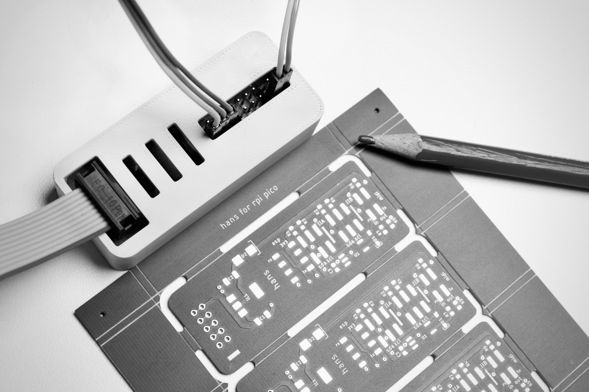

------

#### Hans 2

_OSC UDP and serial MIDI to II over i2c to ER-301 and TXo._

Support for MIDI over USB and BLE tba - Version 2 of Hans now runs on RPI PICO W and is programmed in C. This is the first draft. Hardware and enclosure exist, not yet available, not yet open sourced. 
No ETA on a "stable" version or release, even though what we have here is fully working.

##### _Version: 0.1_

